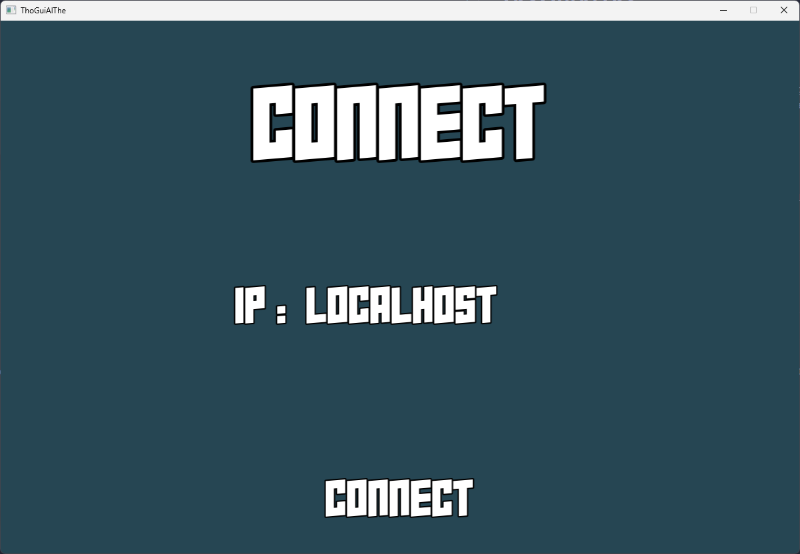
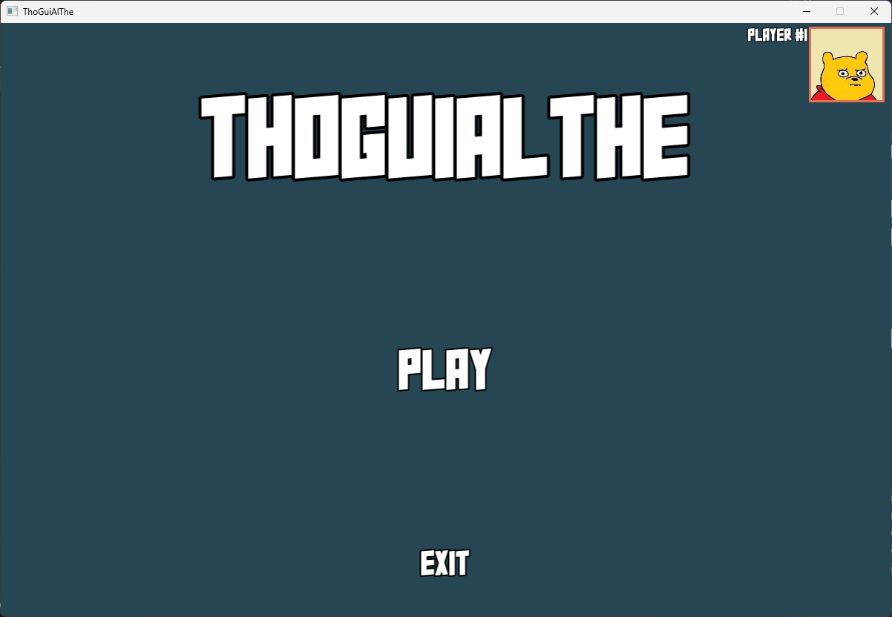
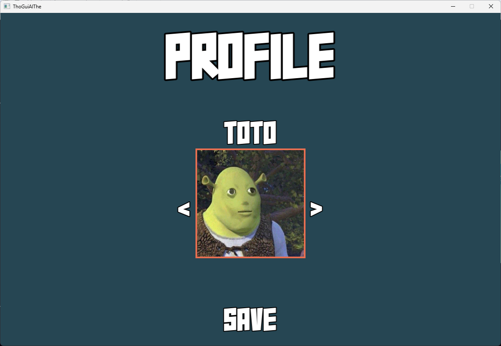
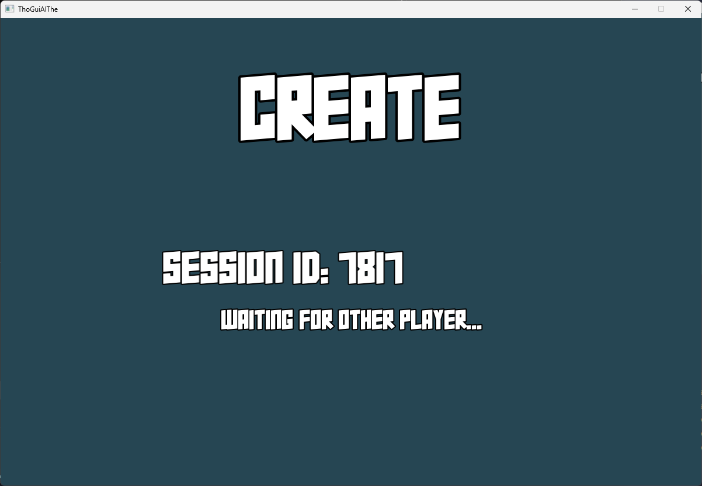
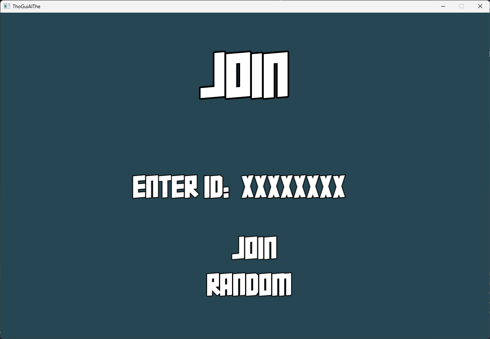
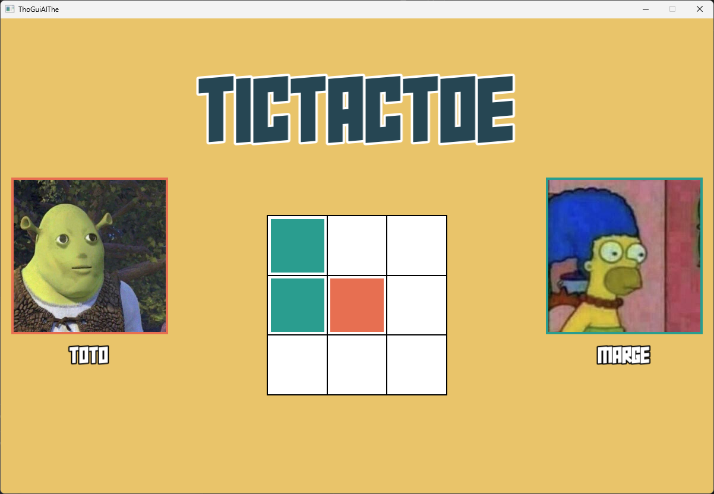
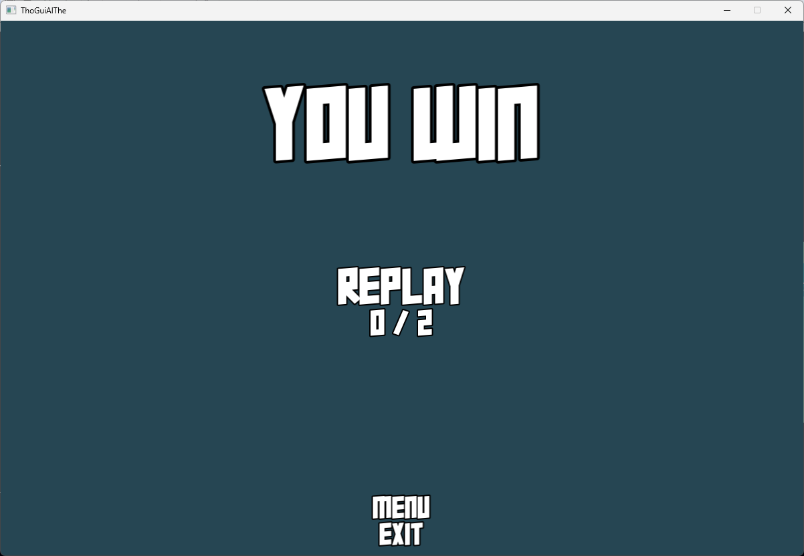

# ThoGuiAlThe
## Context 
This project was made for the course of Windows Online Programing and Multi-Threading.
The goal was to create a basic Tic Tac Toe game with a GUI and a server that can handle multiple games at the same time.

## Features
- Basic TicTacToe game using the [SFML](https://www.sfml-dev.org/) and C++
    - State(scene) manager to easily create multiple views (i.e : Login, Home, Wait, Game)
    - Profile management
- Server sending and receiving messages from multiple clients
    - 'send' and 'receive' procedure via Windows window events
        - Custom window messages
        - Send and Read data as json using [C++ json library](https://github.com/nlohmann/json)
    - Session management to manage multiple games
    - Send all sessions updates to a Web server
- Multi-threading paradigms and functionalities
    - Web Server and Server network manager both running on independents threads
    - Client network manager running on independent thread

## How to use
1. Download the project in the GitHub release section.
2. Run the local server by executing the `server.exe` file.
3. Run the client by executing the `client.exe` file.
4. Enjoy the game!

**NOTE :** You can run multiple clients at the same time.

## How to play

> Make sure the server is running. :)

### Connexion
When you start `client.exe`, you will need to connect to the server.

---

### Home
Once connected, you can play or customize your profile.

---
|               Menu               |               Profile               |
|:--------------------------------:|:-----------------------------------:|
|  |  |

### Start A Game
When you start a game, you will need to either create or join a session.

---
|               Create               |               Join               |
|:----------------------------------:|:--------------------------------:|
|  |  |

### Game
Once you are in a session, you can play the game. The game will automatically start when there is 2 players in the session.
When the game is over, you you will be able to restart the game or go back to the home screen.

---
|              In-Game               |             Game End             |
|:----------------------------------:|:--------------------------------:|
|  |  |

